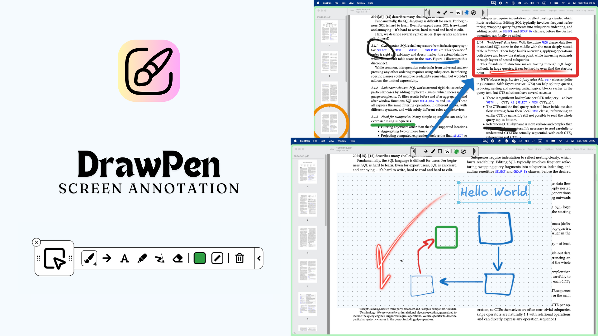

<p align="center">
  
  <h1 align="center">DrawPen for Fedora COSMIC</h1>
  <p align="center">A community-maintained DrawPen build for teaching and screen annotation on Fedora 44 COSMIC</p>
</p>

<p align="center">
  <a href="LICENSE"></a>
  
  
  
</p>

> [!IMPORTANT]
> This is an **unofficial community derivative** of [DmytroVasin/DrawPen](https://github.com/DmytroVasin/DrawPen). It is not published, maintained, or endorsed by the upstream author. The original copyright notice and MIT license are preserved.



## Why this edition exists

This edition keeps the upstream DrawPen structure and adds fixes for the X11 compatibility path used by Electron on **Fedora 44 with the COSMIC desktop**, plus classroom-oriented drawing tools. The project currently targets that tested environment; behavior on other distributions, desktop environments, Wayland-native sessions, or multi-monitor layouts may differ.

## Highlights

- Stable toolbar placement while switching between Pointer Mode and Draw Mode, including restoration after restart.
- X11 input-region shaping so Pointer Mode allows clicks to pass through to applications underneath the canvas.
- Reduced black overlay and trailing artifacts while dragging the toolbar on COSMIC.
- White, cream, blue, slate, and black boards with configurable size, opacity, spacing, dots, lines, grid, or polka patterns.
- Full-screen capture saved to the user's `Pictures/Screenshots` directory.
- Pen width slider from 2 to 32 px with live cursor preview.
- Preset and custom drawing colors shared by drawing tools.
- Straight lines, arrows, squares, rectangles, circles, ovals, triangles, and configurable tables/matrices.
- Numbered horizontal or vertical lines for axes, with configurable bounds and classroom-friendly label spacing.
- Bold text support.

See [CHANGELOG.md](CHANGELOG.md) for the complete change summary and [FEDORA_44_COSMIC.md](FEDORA_44_COSMIC.md) for platform notes.

## Installation on Fedora 44 COSMIC

Download the RPM from the [latest release](https://github.com/MAlexVR/DrawPen-Fedora-COSMIC/releases/latest), then install it with:

```bash
sudo dnf install ./drawpen-0.0.56-1.x86_64.rpm
```

The included desktop launcher starts DrawPen through the X11 compatibility backend required by this build. After installation, launch **DrawPen** from the COSMIC application launcher.

The release notes include the SHA-256 checksum. You can verify the downloaded package with:

```bash
sha256sum drawpen-0.0.56-1.x86_64.rpm
```

Expected checksum:

```text
247f1cd8d570938851090a0f1de263b5249e924e2c4ec1cd5b366507f2410821
```

## Main controls

| Action | Shortcut or control |
| --- | --- |
| Switch Draw/Pointer Mode | <kbd>Ctrl</kbd> + <kbd>Shift</kbd> + <kbd>A</kbd> |
| Pen | <kbd>P</kbd> or <kbd>1</kbd> |
| Cycle shapes | <kbd>2</kbd> |
| Numbered line | <kbd>N</kbd> |
| Text | <kbd>T</kbd> or <kbd>3</kbd> |
| Toggle bold while editing text | <kbd>Ctrl</kbd> + <kbd>B</kbd> |
| Highlighter | <kbd>H</kbd> or <kbd>4</kbd> |
| Laser | <kbd>L</kbd> or <kbd>5</kbd> |
| Eraser | <kbd>E</kbd> or <kbd>6</kbd> |
| Switch color | <kbd>7</kbd> |
| Switch width | <kbd>8</kbd> |
| Show/hide toolbar | <kbd>Ctrl</kbd> + <kbd>T</kbd> |
| Show/hide board | <kbd>Ctrl</kbd> + <kbd>E</kbd> |
| Clear drawings | <kbd>Ctrl</kbd> + <kbd>K</kbd> |
| Settings | <kbd>Ctrl</kbd> + <kbd>,</kbd> |

Pointer Mode makes the full-screen drawing surface click-through while keeping the compact toolbar interactive. Draw Mode captures pointer input so you can annotate the screen.

## Build from source

Prerequisites:

- Fedora 44 on x86_64.
- Node.js 22.22.x.
- C compiler and X11 development libraries for the input-shape helper.
- RPM packaging tools.

For the complete development and packaging instructions, see [CONTRIBUTING.md](CONTRIBUTING.md).

## Upstream relationship

This repository is based on upstream DrawPen 0.0.56. General-purpose fixes and features should be proposed to the [upstream project](https://github.com/DmytroVasin/DrawPen) whenever they can be separated cleanly from the Fedora/COSMIC compatibility layer. Please reproduce platform-specific bugs on Fedora 44 COSMIC before reporting them here.

## License and attribution

DrawPen was created by Dmytro Vasin and contributors. This derivative preserves the upstream copyright notice and is distributed under the same [MIT License](LICENSE). See [NOTICE.md](NOTICE.md) for attribution and project-status details.
